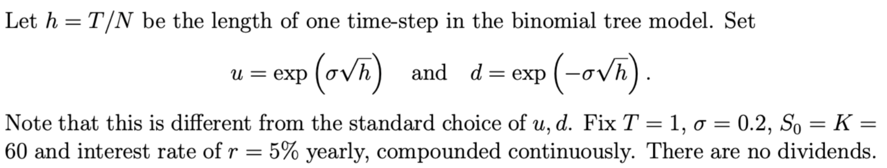
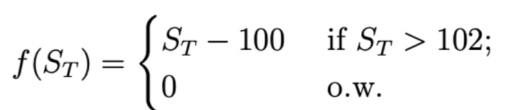

```{r setup, include=FALSE}
knitr::opts_chunk$set(echo = TRUE)
```

# Problem 1

## 1. Compute the price P (0, S0) of a European Put with the above parameters using N = 4, 8, 15, 30, 60, 100, 150 (i.e. varying the number of steps, while keeping the maturity fixed and using the particular scaling of u and d above. Note that as N grows, h shrinks.)



```{r}
binTree_put <- function(S=60, K=60,N,r=0.05,delta=0, T = 1,sigma = 0.2) {
h <- T/N
u <- exp(sigma * sqrt(h))
d <- exp(- sigma * sqrt(h))
disc <- exp(-r*h)
q <- (1-d)/(u-d)
V <- array(0, dim=c(N+1,N+1)) # matrix for storing all the option premia at each node
Del <- B <- array(0, dim=c(N+1,N+1))

for (i in 0:(N)) {  # terminal payoff
  finalS <- S*(u)^i*(d)^(N-i)
  V[N+1,i+1] <- max(K - finalS, 0)     # Put payoff
}
V_rn=V  # the direct risk-neutral computation -- gives same answers as V

for (j in (N):1) {  # column in the tree
    for (i in 0:(j-1)) {  # i counts number of up-moves in the j-th column
        curS = S * u^(i) * d^(j-1-i)
        B[j,i+1] = disc*( u*V[j+1,i+1] - d*V[j+1,i+2] )/(u - d)
        Del[j,i+1] = exp(-delta*h)*( V[j+1,i+2] - V[j+1,i+1] )/(curS * u - curS * d)
        V[j,i+1] = Del[j,i+1]*curS + B[j,i+1]
        V_rn[j,i+1] <- disc*( q*V_rn[j+1,i+2] + (1-q)*V_rn[j+1,i+1] )
    }
}

Delta0 <- exp(-delta*h)*(V[2,2]-V[2,1])/(S*(u-d))  # V[2,2] = C_u, V[2,1]=C_d
return (list(premia = V,Delta=Del,Bank=B) )
}
```

```{r,echo=FALSE}
# Determing the put premium under each N value
price_p <- function(a){
  price_set <- numeric(length(a))
  
  for (i in seq_along(a)){
    price_N <- binTree_put(N=a[i])
    price_set[i] <- price_N$premia[1,1]
    }
  
  names(price_set) <- paste0("P(N = ",a,")")
  
  return(price_set)
  }

# set of N number 
N <- c(4, 8, 15, 30, 60, 100, 150)

# table of put premium   
Put_Premium <- price_p(a = N)
Put_Premium
```

## 2. Also compute the Black-Scholes price of this Put $P_{BS}(0, S0)$. Comment on the answer in relation to what you obtained in part 1.

```{r,echo=FALSE}
BSoption <- function(t = 0, T, S, K, r, q = 0, sigma, isPut = 0) {
  # Calculate d1 and d2 for the Black-Scholes formula
  d1 <- (log(S / K) + (r - q + sigma^2 / 2) * (T - t)) / (sigma * sqrt(T - t))
  d2 <- d1 - sigma * sqrt(T - t)
  
  # Calculate Greeks
  Delta <- ifelse(isPut, -exp(-q * (T - t)) * pnorm(-d1), exp(-q * (T - t)) * pnorm(d1))
  Gamma <- exp(-q * (T - t)) * dnorm(d1) / (S * sigma * sqrt(T - t))
  Vega <- S * exp(-q * (T - t)) * dnorm(d1) * sqrt(T - t)
  Theta <- ifelse(isPut,
                  -S * exp(-q * (T - t)) * sigma / (2 * sqrt(T - t)) * dnorm(d1) + r * K * exp(-r * (T - t)) * pnorm(-d2) - q * S * exp(-q * (T - t)) * pnorm(-d1),
                  -S * exp(-q * (T - t)) * sigma / (2 * sqrt(T - t)) * dnorm(d1) - r * K * exp(-r * (T - t)) * pnorm(d2) + q * S * exp(-q * (T - t)) * pnorm(d1))
  Rho <- ifelse(isPut,
                -(T - t) * K * exp(-r * (T - t)) * pnorm(-d2),
                (T - t) * K * exp(-r * (T - t)) * pnorm(d2))
  
  # Calculate Black-Scholes price
  BSprice <- ifelse(isPut,
                    K * exp(-r * (T - t)) * pnorm(-d2) - S * exp(-q * (T - t)) * pnorm(-d1),
                    S * exp(-q * (T - t)) * pnorm(d1) - K * exp(-r * (T - t)) * pnorm(d2))
  
  # Calculate Arbitrage
  Bank <- BSprice - Delta * S
  
  return(list(Delta = Delta, Gamma = Gamma, Theta = Theta, Vega = Vega, Rho = Rho, Price = BSprice, d1 = d1, d2 = d2, B = Bank))
}

```

```{r}
# Calculate the Black-Scholes price for the Put option
putOptionPrice <- BSoption(t = 0, T = 1, S = 60, K = 60, r = 0.05, q = 0, sigma = 0.2, isPut = 1)

# Print the Black-Scholes price for the Put option
print(paste("Black-Scholes price for the Put option:", putOptionPrice$Price))
```

Answer: The price $P(0, S_0)$ of a European Put option calculated using different step numbers ($N$) approaches the Black-Scholes price $P_{BS}(0, S_0)$ as $N$ increases, reflecting the binomial model's convergence to the continuous Black-Scholes model.

## 3. Repeat the above for the Put Delta, i.e. compute the initial Delta of the Put using the binomial tree and N = 4, 8, 15, 30, 60, 100, 150, and compare to the Black-Scholes $\bigtriangleup BS (0, S0)$.

```{r,echo=FALSE}
  # Determing the put premium under each K value
delta_p <- function(a){
  delta_set <- numeric(length(a))
  
  for (i in seq_along(a)){
    delta_N <- binTree_put(N=a[i])
    delta_set[i] <- delta_N$Delta[1,1]
    }
  
  names(delta_set) <- paste0("Delta(N = ", a,")")
  
  return(delta_set)
  }
  
# set of N number
N <- c(4, 8, 15, 30, 60, 100, 150)

# table of put delta
Put_delta <- delta_p(a = N)
Put_delta
```

```{r}
# Print the Black-Scholes price for the Put option
print(paste("Black-Scholes delta for the Put option:", putOptionPrice$Delta))
```

Answer：The initial Delta of the Put, calculated using a binomial tree for $N = 4, 8, 15, 30, 60, 100, 150$, approaches the Black-Scholes Delta ($\Delta_{BS}(0, S_0)$) as $N$ increases, similar to the convergence observed with option premiums.

## 4. Repeat part 1 for volatility values σ = 0.25, 0.3, 0.4. Hand in a table: rows are the different values of N (as well as the Black-Scholes limit) and the columns are the corresponding model-based Put prices. What happens to $P_{BS}$ (0, S0) as a function of $\sigma$?

```{r}
# Function to calculate put premiums for each N and sigma
price_p <- function(N, Sigma){
  # Adjusting the matrix to include an additional row for Black-Scholes prices
  price_matrix <- matrix(nrow = length(N) + 1, ncol = length(Sigma), dimnames = list(c(paste("N", N, sep = "_"), "BS"), paste("Sigma", Sigma, sep = "_")))
  
  for (i in seq_along(N)) {
    for (j in seq_along(Sigma)) {
      price_N <- binTree_put(N = N[i], sigma = Sigma[j])
      price_matrix[i, j] <- price_N$premia[1,1]
    }
  }
  
  # Correcting the loop for calculating Black-Scholes prices
  for (j in seq_along(Sigma)){
    bs_price <- BSoption(t=0, T=1, S=60, K=60, r=0.05, q=0, sigma=Sigma[j], isPut=1)
    price_matrix[length(N) + 1, j] <- bs_price$Price
  }
  
  return(price_matrix)
}

# Example usage
N <- c(4, 8, 15, 30, 60, 100, 150)
Sigma <- c(0.25, 0.3, 0.4)
Put_Premium <- price_p(N, Sigma)
print(Put_Premium)

```

Answer: Volatility ($\sigma$) has a positive relationship with put option premiums, with other factors held constant.

# Problem 2

Consider a stock paying continuous dividends of $\delta = 3%$. Assume a Black-Scholes model with r = 0.06, $\sigma = 0.32$ and today's stock price of S0 = 40.

## a) You sell 10 Calls with strike K = 42 and expiration in 70 days (assume 365 days in a year). You also construct a Delta hedge to manage your risk. If 1 day later stock price rises to \$40.50, find your net profit/loss from your hedged portfolio. Hint: don't forget about dividends!

```{r,echo=FALSE}
# Define the advanced Black-Scholes function
BSoption <- function(t = 0, T, S, K, r, q = 0, sigma, isPut = 0) {
  d1 <- (log(S/K) + (r - q + sigma^2 / 2) * (T - t)) / (sigma * sqrt(T - t))
  d2 <- d1 - sigma * sqrt(T - t)
  
  # Call Delta at t
  Delta <- ifelse(isPut == 0, exp(-q * (T - t)) * pnorm(d1), -exp(-q * (T - t)) * pnorm(-d1))
  
  # Black-Scholes price for Call or Put
  BSprice <- ifelse(isPut == 0, 
                    -K * exp(-r * (T - t)) * pnorm(d2) + S * Delta, 
                    S * Delta + K * exp(-r * (T - t)) * pnorm(-d2))
  
  Bank <- BSprice - Delta * S
  
  return(list(Delta = Delta, Price = BSprice, B = Bank))
}
```

```{r}
S0 <- 40
K <- 42
T <- 70 / 365
r <- 0.06
q <- 0.03  # Using q to represent continuous dividend yield
sigma <- 0.32
n_options <- 10

# Initial option and hedge
initial_result <- BSoption(t = 0, T = T, S = S0, K = K, r = r, q = q, sigma = sigma, isPut = 0)
initial_option_price <- initial_result$Price
initial_delta <- initial_result$Delta
initial_bank <- initial_result$B
initial_result
```

The delta hedge portfolio would be :

-   Buy 10 \* initial_delta shares at price S0.

-   Borrowing 10 \* \$14.65731 in bank.

At time t = 0, the transaction will be sell 10 call option and do delta hedge portfolio.

-   Sell 10 call options at price 1.502024.

-   Buy 10 \* 0.4039833 shares at stock price \$40.

-   Borrowing \$146.5731 in bank.

```{r}
net_cash_flow0_call <- n_options * (initial_option_price - initial_delta*S0 - initial_bank)
list(NetCashFlow0Call = net_cash_flow0_call)
```

```{r}
# Recalculate after 1 day
S1D <- 40.5
T_new <- (70 - 1) / 365
new_result <- BSoption(t = 1/365, T = T, S = S1D, K = K, r = r, q = q, sigma = sigma, isPut = 0)
new_option_price <- new_result$Price
new_delta <- new_result$Delta
new_bank <- new_result$B
new_result
```

At time t = 1/365,

-   Sell $10 * 0.4039833*e^{\delta*(T-T_{new})}$ shares at stock price \$40.5.

-   Returning $10*14.65731 * e^{r*(T-T_{new})}$ in bank.

-   Buy 10 \* 0.4374756 at stock price \$40.5.

-   Borrowing 10\*\$16.02226 in bank.

```{r}
net_cash_flow1_call <- n_options * (initial_delta*exp(q*(T-T_new))*S1D 
                               + initial_bank * exp(r*(T-T_new))
                               -new_delta*S1D
                               -new_bank)
list(NetCashFlow1Call = net_cash_flow1_call)
```

## b) Repeat this problem for the case of selling 10 Puts with strike K = 42 and all other parameters staying the same.

```{r}
# Define parameters
S0 <- 40  # Initial stock price
K <- 42   # Strike price
T <- 70 / 365  # Time to expiration in years
r <- 0.06  # Risk-free interest rate
q <- 0.03  # Continuous dividend yield
sigma <- 0.32  # Volatility
n_puts <- 10  # Number of put options

# Initial valuation and delta of put options
initial_put_result <- BSoption(t = 0, T = T, S = S0, K = K, r = r, q = q, sigma = sigma, isPut = 1)
initial_put_result
initial_put_price <- initial_put_result$Price
initial_put_delta <- initial_put_result$Delta
initial_put_bank <- initial_put_result$B

```

The delta hedge portfolio would be :

-   Selling 10 \* initial_delta shares at price S0.

-   Investing 10 \* \$26.86218 in bank.

At time t = 0, the transaction will be sell 10 put option and do delta hedge portfolio.

-   Sell 10 put options at price \$3.250983.

-   Selling 10 \* 0.5902798 shares at stock price \$40.

-   Investing 10\* \$ 26.86218 in bank.

```{r}
net_cash_flow0_call <- n_options * (initial_put_price - initial_put_delta*S0 - initial_put_bank)
list(NetCashFlow0Call = net_cash_flow0_call)
```

```{r}
# Revaluation after 1 day
S1D <- 40.5
T_new <- (70 - 1) / 365
new_put_result <- BSoption(t = 0, T = T_new, S = S1D, K = K, r = r, q = q, sigma = sigma, isPut = 1)
new_put_price <- new_put_result$Price
new_put_delta <- new_put_result$Delta
new_put_bank <- new_put_result$B
new_put_result

```

At time t = 1/365,

-   Buying $10 * 0.5902798*e^{\delta*(T-T_{new})}$ shares at stock price \$40.5.

-   Earning $10*26.86218 * e^{r*(T-T_{new})}$ in bank.

-   Selling 10 \* 0.5568692 at stock price \$40.5.

-   Investing 10\*\$25.50404 in bank.

```{r}
net_cash_flow1_put <- n_options * (initial_put_delta*exp(q*(T-T_new))*S1D 
                               + initial_put_bank * exp(r*(T-T_new))
                               -new_put_delta*S1D
                               -new_put_bank)
list(NetCashFlow1Put = net_cash_flow1_put)
```

## c) Explain the relationship between your answers in (a) and in (b). Hint: think about the value of the portfolio that consists of buying 10 Calls and selling 10 Puts by invoking Put-Call parity.

```{r}
C_P_markt <- initial_option_price - initial_put_price
C_P_parity <- S0*exp(-q*T) - exp(-r*T)*K
list(CPMarkt = C_P_markt,
     CPparity = C_P_parity)
```

Answer:

Since the market price of the call (CP_Market) is equal to the price derived from put-call parity (CP_Parity), and given that the call and put options have the same strike price and expiration time, we can construct a risk-neutral portfolio by buying 10 calls and selling 10 puts. According to the principle of risk neutrality, one should not expect to make a profit or loss over time with such a portfolio. That is to say, the net cash flow from selling 10 puts and maintaining its corresponding delta hedge should be offset by the net cash flow from buying 10 calls and maintaining its corresponding delta hedge at any given time.

From the calculations in part b, the net cash flow after one day from selling 10 puts is +\$0.074. According to part a, selling 10 calls also results in a +\$0.074 cash flow one day later, so buying 10 calls would lead to the opposite cash flow, which is -\$0.074. Therefore, the net cash flows from the two positions would cancel each other out after one day.

# Problem 3

Consider a Black-Scholes model with $\sigma = 0.25, S(0) = 50, r = 0.03, \delta= 0.01.$ Suppose you construct a butterfly strategy, buying a European Put option with K = 40, selling two Puts with K = 45 and buying a Put with K = 50. All options expire at T = 1.

## 1. Find the aggregate value, Delta, Gamma, and Theta of the option portfolio.

```{r,echo=FALSE}
BSput <- function(t = 0, T, S, K, r, q = 0, sigma, isPut = 1) {
  # Calculate d1 and d2 for the Black-Scholes formula
  d1 <- (log(S / K) + (r - q + sigma^2 / 2) * (T - t)) / (sigma * sqrt(T - t))
  d2 <- d1 - sigma * sqrt(T - t)
  
  # Calculate Greeks
  Delta <- ifelse(isPut, -exp(-q * (T - t)) * pnorm(-d1), exp(-q * (T - t)) * pnorm(d1))
  Gamma <- exp(-q * (T - t)) * dnorm(d1) / (S * sigma * sqrt(T - t))
  Vega <- S * exp(-q * (T - t)) * dnorm(d1) * sqrt(T - t)
  Theta <- ifelse(isPut,
                  -S * exp(-q * (T - t)) * sigma / (2 * sqrt(T - t)) * dnorm(d1) + r * K * exp(-r * (T - t)) * pnorm(-d2) - q * S * exp(-q * (T - t)) * pnorm(-d1),
                  -S * exp(-q * (T - t)) * sigma / (2 * sqrt(T - t)) * dnorm(d1) - r * K * exp(-r * (T - t)) * pnorm(d2) + q * S * exp(-q * (T - t)) * pnorm(d1))
  Rho <- ifelse(isPut,
                -(T - t) * K * exp(-r * (T - t)) * pnorm(-d2),
                (T - t) * K * exp(-r * (T - t)) * pnorm(d2))
  
  # Calculate Black-Scholes price
  BSprice <- ifelse(isPut,
                    K * exp(-r * (T - t)) * pnorm(-d2) - S * exp(-q * (T - t)) * pnorm(-d1),
                    S * exp(-q * (T - t)) * pnorm(d1) - K * exp(-r * (T - t)) * pnorm(d2))
  
  # Calculate Arbitrage
  Bank <- BSprice - Delta * S
  
  return(list(Delta = Delta, Gamma = Gamma, Theta = Theta, Vega = Vega, Rho = Rho, Price = BSprice, d1 = d1, d2 = d2, B = Bank))
}
```

```{r}
# Given parameters
sigma <- 0.25
S0 <- 50
r <- 0.03
delta <- 0.01
T <- 1

# Compute the values for each put option
put40 <- BSput(T=T, S=S0, K=40, r=r, q=delta, sigma=sigma, isPut=1)
put45 <- BSput(T=T, S=S0, K=45, r=r, q=delta, sigma=sigma, isPut=1)
put50 <- BSput(T=T, S=S0, K=50, r=r, q=delta, sigma=sigma, isPut=1)

# The aggregate values for the butterfly spread
aggregate_value <- -put40$Price + 2 * put45$Price - put50$Price
aggregate_delta <- -put40$Delta + 2 * put45$Delta - put50$Delta
aggregate_gamma <- -put40$Gamma + 2 * put45$Gamma - put50$Gamma
aggregate_theta <- -put40$Theta + 2 * put45$Theta - put50$Theta

# Output the aggregate values
list(AggregateValue = aggregate_value,
     AggregateDelta = aggregate_delta,
     AggregateGamma = aggregate_gamma,
     AggregateTheta = aggregate_theta)
```

## 2. Suppose that tomorrow the share price falls to S(1/365) = 49.80

-   Find the new value of the portfolio tomorrow, and hence compute the overnight loss/gain compared to today.

```{r}
# Given parameters
sigma <- 0.25
S1D <- 49.80
r <- 0.03
delta <- 0.01
T_new <- 1 - 1/365

# Compute the values for each put option
put40_1D <- BSput(T=T_new, S=S1D, K=40, r=r, q=delta, sigma=sigma, isPut=1)
put45_1D <- BSput(T=T_new, S=S1D, K=45, r=r, q=delta, sigma=sigma, isPut=1)
put50_1D <- BSput(T=T_new, S=S1D, K=50, r=r, q=delta, sigma=sigma, isPut=1)

# The aggregate values for the butterfly spread
aggregate_value_1D <- -put40_1D$Price + 2 * put45_1D$Price - put50_1D$Price
aggregate_delta_1D <- -put40_1D$Delta + 2 * put45_1D$Delta - put50_1D$Delta
aggregate_gamma_1D <- -put40_1D$Gamma + 2 * put45_1D$Gamma - put50_1D$Gamma
aggregate_theta_1D <- -put40_1D$Theta + 2 * put45_1D$Theta - put50_1D$Theta

Net_gain_loss <- aggregate_value_1D - aggregate_value

# Output the aggregate values
list(AggregateValue_1D = aggregate_value_1D,
     AggregateDelta_1D = aggregate_delta_1D,
     AggregateGamma_1D = aggregate_gamma_1D,
     AggregateTheta_1D = aggregate_theta_1D,
     NetGainLoss = Net_gain_loss)
```

Answer : We have net loss \$0.005610288.

-   Estimate the overnight portfolio loss in the above scenario using the Delta approximation.

```{r}
Delta_approximation <- aggregate_delta * (S1D - S0)
```

-   Estimate the overnight portfolio loss in the above scenario using a Delta-Gamma approximation

```{r}
Delta_Gamma_approximation <- aggregate_delta * (S1D - S0) + aggregate_gamma * ((S1D - S0)^2)/2
```

-   Estimate the overnight portfolio loss in the above scenario using a Delta-Theta approximation

```{r}
Delta_Theta_approximation <- aggregate_delta * (S1D - S0) + aggregate_theta * 1/356
```

```{r,echo=FALSE}
# Output the approximations
list(Direct_Net_Gain_Loss = Net_gain_loss,
     Delta_Approximation = Delta_approximation,
     Delta_Gamma_Approximation = Delta_Gamma_approximation,
     Delta_Theta_Approximation = Delta_Theta_approximation
     )
```

## 3. Recall that the Greeks are partial derivatives of the portfolio value with respect to the given parameter. Instead of using calculus to find the derivative, we may use a finite-difference approximation. For example, to approximate Theta we can use Taylor expansion: for a small perturbation $\epsilon$. This means you compute the portfolio value plugging in T for time to maturity, then plugging-in $T - \epsilon$ for time-to-maturity and look at the difference. Use the above method to approximate the Theta of the above portfolio. Use $\epsilon = 0.001$. Compare to the true Theta in part 1.

```{r}
e <- 0.001
T_e <- 1 - e
put40_e <- BSput(T=T_e, S=S0, K=40, r=r, q=delta, sigma=sigma, isPut=1)
put45_e <- BSput(T=T_e, S=S0, K=45, r=r, q=delta, sigma=sigma, isPut=1)
put50_e <- BSput(T=T_e, S=S0, K=50, r=r, q=delta, sigma=sigma, isPut=1)

# compute the aggregate value at T - e
aggregate_value_e <- -put40_e$Price + 2 * put45_e$Price - put50_e$Price

# Theta approximation using finite-difference method
Theta_approximation <- (aggregate_value_e - aggregate_value) / e

list(AggregateThetaApproximation = Theta_approximation,
     TrueAggregateTheta = aggregate_theta)

```

# Problem 4

Consider a Gap Call (see Section 14.5 in text) that pays

{width="329"}

Assume S0 = 100, $\sigma = 0.28$, r = 0.06, $\delta= 0.02$ and T = 0.25. We use a Black-Scholes model, so that ST is log-normal.

## 1. Using algebra, compute the risk neutral probability Q(ST \> 102):

$$
Q(S_T > 102) = Q\left(\frac{S_T}{S_0} > \frac{102}{S_0}\right), \quad S_0 = 100
$$ $$
= Q\left(\frac{S_T}{S_0} > 1.02\right)
$$ $$
= Q\left(\ln\left(\frac{S_T}{S_0}\right) > \ln(1.02)\right), \text{ where } \ln\left(\frac{S_T}{S_0}\right) = \left(\mu - \frac{\sigma^2}{2}\right) t + \sigma \sqrt{t} Z, Z \sim N(0,1)
$$ $$
= Q\left(\left(\mu - \frac{\sigma^2}{2}\right) t + \sigma \sqrt{t} Z > \ln(1.02)\right), \text{ where } \sigma = 0.28, r = 0.06, \delta = 0.02, T = 0.25, \mu = r - \delta
$$ $$
= Q\left(\left(0.04 - \frac{0.28^2}{2}\right) 0.25 + 0.28 \sqrt{0.25} Z > \ln(1.02)\right)
$$ $$
= Q\left(0.0002 + 0.14Z > \ln(1.02)\right)
$$ $$
= Q\left(Z > \frac{\ln(1.02) - 0.0002}{0.14}\right)
$$ $$
= 1 - \Phi\left(\frac{\ln(1.02) - 0.0002}{0.14}\right)
$$ $$
= 1 - \Phi(-0.14)
$$ $$
= 0.4443
$$

## 2. Using a Monte Carlo simulation with 400 simulated draws of ST (under the risk- neutral probability) estimate the above probability Q(ST \> 102) & compare to the answer in i).

```{r}
set.seed(1014)
n <- 400 # number of simulations
Z <- rnorm(n, 0, 1) # Generates 'n' random normal variables
S0 <- 100 # Initial stock price
r <- 0.06 # Risk-free rate
delta <- 0.02 # Dividend yield
sigma <- 0.28 # Volatility
T <- 0.25 # Time to maturity

# Function to simulate stock prices at time T
S_t <- function(S0, r, delta, sigma, T, Z){
  mu <- r - delta # Adjusted drift
  S_t_vector <- S0 * exp((mu - sigma^2 / 2) * T + sigma * sqrt(T) * Z) # Vectorized calculation
  return(S_t_vector)
}

# Simulate stock prices and calculate the proportion exceeding $102
simulated_prices <- S_t(S0, r, delta, sigma, T, Z)
pro_price_exceed102 <- mean(simulated_prices > 102) # Cleaner calculation using mean()

# Define the formula probability for comparison
formula_probability <- 0.4443

# Prepare and print the comparison
comparison <- list(
  Monte_Carlo_Probability = pro_price_exceed102,
  Formula_Probability = formula_probability,
  Difference = pro_price_exceed102 - formula_probability
)

print(comparison)
```

Answer: Compared with the formula probability (0.4443) from part a, what we get from 400 simulations, 0.4625, is close to that but with a 1.82% variation.

## 3. Using the same Monte Carlo simulation with 400 simulations of ST as in part ii), find the approximate price of the Gap Call. Compare to the exact answer given by the formula 14.15 in the textbook.

### Using Monte Carlo simulation:

```{r}
# Function to calculate the payoff of a Gap Call
gap_call_payoff <- function(S_t, gap){
  pay_off_vector <- ifelse(S_t > gap, S_t - 100, 0)
  return(pay_off_vector) 
}

# Function to calculate the present value of the Gap Call
C0 <- function(pay_off_vector, r, T){
  C0 <- mean(pay_off_vector) * exp(-r * T)
  return(C0)
}

# Monte Carlo simulation to calculate the price of the Gap Call
gap <- 102
pay_off_vector <- gap_call_payoff(simulated_prices, gap)
simulated_call_premium <- C0(pay_off_vector, r, T)

# Print the simulated call premium
simulated_call_premium
```

### Using Formula 14.15:

```{r,echo=FALSE}
# Define the Black-Scholes call and put pricing function
BScall <- function(t=0, T, S, K1, K2, r, q=0, sigma, isPut=0) {
  # Calculate d1 and d2 using the Black-Scholes formula components
  d1 <- (log(S/K2) + (r - q + sigma^2/2) * (T - t)) / (sigma * sqrt(T - t))
  d2 <- d1 - sigma * sqrt(T - t)
  
  # Calculate binary component used in some option pricing models
  binary <- pnorm(-d2) * exp(-r * T)
  
  # Calculate Greeks for calls
  Delta <- exp(-q * (T - t)) * pnorm(d1)
  Gamma <- exp(-q * (T - t)) * dnorm(d1) / (S * sigma * sqrt(T - t))
  Vega <- S * Delta * sqrt(T - t)
  Theta <- -S * Delta * sigma / (2 * sqrt(T - t)) - r * K1 * exp(-r * (T - t)) * pnorm(d2) +
    q * S * Delta
  Rho <- (T - t) * K1 * exp(-r * (T - t)) * pnorm(d2)
  
  # Calculate Black-Scholes price for calls
  BSprice <- S * Delta - K1 * exp(-r * (T - t)) * pnorm(d2)
  
  # Adjust calculations if it's a put option
  if (isPut == 1) {
    Delta <- -exp(-q * (T - t)) * pnorm(-d1)
    BSprice <- S * Delta + K1 * exp(-r * (T - t)) * pnorm(-d2)
    Theta <- -S * Delta * sigma / (2 * sqrt(T - t)) + r * K1 * exp(-r * (T - t)) * pnorm(-d2) -
      q * S * Delta
    Rho <- -(T - t) * K1 * exp(-r * (T - t)) * pnorm(-d2)
  }
  
  # Calculate the hedge parameter (B)
  Bank <- BSprice - Delta * S
  
  # Return a list of calculated values
  return(list(Delta=Delta, Gamma=Gamma, Theta=Theta, Vega=Vega, Rho=Rho, 
              Price=BSprice, d1=d1, d2=d2, B=Bank))
}

```

```{r}
# Set initial parameters
S0 <- 100   # Initial stock price
r <- 0.06   # Risk-free rate
delta <- 0.02  # Dividend yield
sigma <- 0.28  # Volatility
T <- 0.25   # Time to maturity
K1 <- 100   # Strike price
K2 <- 102   # Trigger price for the gap option

# Calculate the Black-Scholes price for a call option
price0 <- BScall(t=0, T=T, S=S0, K1=K1, K2=K2, r=r, q=delta, sigma=sigma, isPut=0)

# Compare the Monte Carlo simulated price with the Black-Scholes formula price
comparison_list <- list(
  Monte_Carlo_Premium = simulated_call_premium,
  Formula_Premium = price0$Price,
  Differences_Premium = simulated_call_premium - price0$Price
)

# Print the comparison list
print(comparison_list)
```

Answer: The call premiums calculated using the two methods are very close to each other, with only a 0.83 dollar variation.

# Problem 5

We consider implementing Delta hedging using discrete-time rebalancing. Namely, let us take options with T = 4/52 or 4 weeks until maturity, r = 0.04, $\delta= 0, \sigma = 0.25$ and\
consider weekly rebalancing. The initial share price is S(0) = 100, the contract is a long Put and the strike is K = 100. Throughout we use the Black-Scholes Price/Delta.

For each scenario of realized prices below, compute the total Delta-hedging P&L, which is the future value at T of the rebalancing costs at t = 1, 2, 3 weeks plus the final net profit (Put payoff minus the value of the hedging portfolio). Below $t_k := k/52$ refers to the end of the k-th week; $t_4 = T$ is the contract maturity at 4 weeks.

## 1. S(t1) = 99, S(t2) = 99, S(t3) = 100, S(t4) = 99

```{r}
# Parameters
S0 <- 100
K <- 100
T <- 4 / 52
r <- 0.04
q <- 0  # Using q to represent continuous dividend yield
sigma <- 0.25

# Initial option and hedge
initial_result <- BSoption(t = 0, T = T, S = S0, K = K, r = r, q = q, sigma = sigma, isPut = 1)
initial_option_price <- initial_result$Price
initial_delta <- initial_result$Delta
initial_bank <- initial_result$B
initial_result
```

At $t_0 = 0$ :

-   Long put at price \$2.610472

-   Buying 0.4684985 shares with stock price \$100.

-   Borrowing \$49.46032 in the bank.

```{r}
net_cash_flow0 <- -initial_option_price + initial_delta*S0 + initial_bank
net_cash_flow0 
```

```{r}
# rebalancing at t1
S1 <- 99
t1 <- 1/52
week1_result <- BSoption(t = t1, T = T, S = S1, K = K, r = r, q = q, sigma = sigma, isPut = 1)
week1_option_price <- week1_result$Price
week1_delta <- week1_result$Delta
week1_bank <- week1_result$B
week1_result
```

At $t_1 = 1/52$ :

-   Selling 0.4684985 shares with stock price \$99.

-   Returning \$49.46032\*exp(rt) to the bank.

-   Buying 0.5393978 shares with stock price \$99.

-   Borrowing \$56.18536 in bank.

```{r}
net_cash_flow1w <- - initial_delta*S1 - initial_bank*exp(r*t1) + week1_delta * S1 + week1_bank
net_cash_flow1w
```

-   Matches the 0.33 dollar losses in the value of the hedged portfolio in week 1.

```{r}
# rebalancing at t2
S2 <- 99
t2 <- 2/52
week2_result <- BSoption(t = t2, T = T, S = S2, K = K, r = r, q = q, sigma = sigma, isPut = 1)
week2_option_price <- week2_result$Price
week2_delta <- week2_result$Delta
week2_bank <- week2_result$B
week2_result
```

At $t_2 = 2/52$ :

-   Selling 0.5393978 shares with stock price \$99.

-   Returning \$56.18536\*exp(rt) to the bank.

-   Buying 0.55592604 shares with stock price \$99.

-   Borrowing \$57.763646 in bank.

```{r}
net_cash_flow2w <- - week1_delta*S2 - week1_bank*exp(r*(t2-t1)) + week2_delta * S2 + week2_bank
net_cash_flow2w
```

-   Matches the 0.43 dollar losses in the value of the hedged portfolio in week 2.

```{r}
# rebalancing at t3
S3 <- 100
t3 <- 3/52
week3_result <- BSoption(t = t3, T = T, S = S3, K = K, r = r, q = q, sigma = sigma, isPut = 1)
week3_option_price <- week3_result$Price
week3_delta <- week3_result$Delta
week3_bank <- week3_result$B
week3_result
```

At $t_3 = 3/52$ :

-   Selling 0.55592604 shares with stock price \$100.

-   Returning \$57.763646\*exp(rt) to the bank.

-   Buying 0.484327 shares with stock price \$100.

-   Borrowing \$49.76807 in bank.

```{r}
net_cash_flow3w <- - week2_delta*S3 - week2_bank*exp(r*(t3-t2)) + week3_delta * S3 + week3_bank
net_cash_flow3w
```

-   Matches the 0.54 dollar losses in the value of the hedged portfolio in week 3.

```{r}
# expiration at t4
S4 <- 99
t4 <- 4/52
```

At $t_4 = 4/52$ :

-   Selling 0.484327 shares with stock price \$99.

-   Returning \$49.76807\*exp(rt) to the bank.

-   Payoff of using put option is (K-S4)+

```{r}
net_cash_flow4w <- - week3_delta*S4 - week3_bank*exp(r*(t4-t3))+ K - S4
net_cash_flow4w
```

-   Matches the 0.87 dollar losses in the value of the hedged portfolio in week 4 or expiration day.

```{r}
# Assuming r, T, t1, t2, t3, t4, and net_cash_flowXw variables are defined elsewhere in your code

total_Delta_hedging_PL <- net_cash_flow1w * exp(r * (T - t1)) + 
                         net_cash_flow2w * exp(r * (T - t2)) + 
                         net_cash_flow3w * exp(r * (T - t3)) + 
                         net_cash_flow4w * exp(r * (T - t4))

# Print the Black-Scholes price for the Put option
print(paste("Total Delta-hedging P&L:", total_Delta_hedging_PL))
```

## 2. S(t1) = 101, S(t2) = 96, S(t3) = 97, S(t4) = 99

At $t_0 = 0$ :

-   Long put at price \$2.610472

-   Buying 0.4684985 shares with stock price \$100.

-   Borrowing \$49.46032 in the bank.

```{r}
net_cash_flow0 <- -initial_option_price + initial_delta*S0 + initial_bank
net_cash_flow0
```

```{r}
# rebalancing at t1
S1 <- 101
t1 <- 1/52
week1_result <- BSoption(t = t1, T = T, S = S1, K = K, r = r, q = q, sigma = sigma, isPut = 1)
week1_option_price <- week1_result$Price
week1_delta <- week1_result$Delta
week1_bank <- week1_result$B
week1_result
```

At $t_1 = 1/52$ :

-   Selling 0.4684985 shares with stock price \$101.

-   Returning \$49.46032\*exp(rt) to the bank.

-   Buying 0.40743 shares with stock price \$101.

-   Borrowing \$42.98952 in bank.

```{r}
net_cash_flow1w <- - initial_delta*S1 - initial_bank*exp(r*t1) + week1_delta * S1 + week1_bank
net_cash_flow1w
```

-   Matches the 0.34 dollar losses in the value of the hedged portfolio in week 1.

```{r}
# rebalancing at t2
S2 <- 96
t2 <- 2/52
week2_result <- BSoption(t = t2, T = T, S = S2, K = K, r = r, q = q, sigma = sigma, isPut = 1)
week2_option_price <- week2_result$Price
week2_delta <- week2_result$Delta
week2_bank <- week2_result$B
week2_result
```

At $t_2 = 2/52$ :

-   Selling 0.40743 shares with stock price \$99.

-   Returning \$42.98952\*exp(rt) to the bank.

-   Buying 0.7813367 shares with stock price \$99.

-   Borrowing \$79.43025 in bank.

```{r}
net_cash_flow2w <- - week1_delta*S2 - week1_bank*exp(r*(t2-t1)) + week2_delta * S2 + week2_bank
net_cash_flow2w
```

Matches the 0.51 dollar profits in the value of the hedged portfolio in week 2.

```{r}
# rebalancing at t3
S3 <- 97
t3 <- 3/52
week3_result <- BSoption(t = t3, T = T, S = S3, K = K, r = r, q = q, sigma = sigma, isPut = 1)
week3_option_price <- week3_result$Price
week3_delta <- week3_result$Delta
week3_bank <- week3_result$B
week3_result
```

At $t_3 = 3/52$ :

-   Selling 0.7813367 shares with stock price \$97.

-   Returning \$79.43025\*exp(rt) to the bank.

-   Buying 0.7992809 shares with stock price \$97.

-   Borrowing \$80.824338 in bank.

```{r}
net_cash_flow3w <- - week2_delta*S3 - week2_bank*exp(r*(t3-t2)) + week3_delta * S3 + week3_bank
net_cash_flow3w
```

Matches the 0.41 dollar losses in the value of the hedged portfolio in week 3.

```{r}
# expiration at t4
S4 <- 99
t4 <- 4/52
```

At $t_4 = 4/52$ :

-   Selling 0.7992809 shares with stock price \$99.

-   Returning \$80.824338\*exp(rt) to the bank.

-   Payoff of using put option is (K-S4)+

```{r}
net_cash_flow4w <- - week3_delta*S4 - week3_bank*exp(r*(t4-t3))+ K - S4
net_cash_flow4w
```

-   Matches the 0.76 dollar losses in the value of the hedged portfolio in week 4 or expiration day.

```{r}
# Assuming r, T, t1, t2, t3, t4, and net_cash_flowXw variables are defined elsewhere in your code

total_Delta_hedging_PL <- net_cash_flow1w * exp(r * (T - t1)) + 
                         net_cash_flow2w * exp(r * (T - t2)) + 
                         net_cash_flow3w * exp(r * (T - t3)) + 
                         net_cash_flow4w * exp(r * (T - t4))

# Print the Black-Scholes price for the Put option
print(paste("Total Delta-hedging P&L:", total_Delta_hedging_PL))
```
